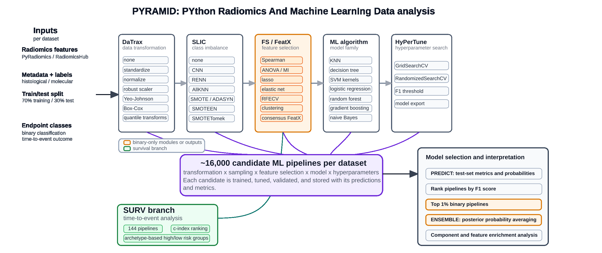
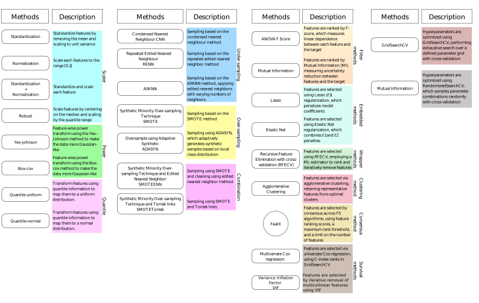

.. _overview:

Overview
========

PYRAMID is structured as a single entry-point program (``PYRAMID``) that dispatches work to eight specialised submodules. Each submodule is an independent Python package that lives under the ``PYRAMID/`` directory and corresponds to one stage of a typical radiomics ML pipeline.

PYRAMID is designed to work on quantitative imaging features extracted with `PyRadiomics <https://pyradiomics.readthedocs.io>`_, an open-source Python package for the extraction of standardised radiomics features from medical images. The expected input is a PyRadiomics feature matrix in TSV format, where each row represents a patient and each column a radiomic feature. While PYRAMID does not perform image segmentation or feature extraction itself, it takes over immediately after, covering the full path from raw feature matrix to trained and validated predictive models.

   Schematic representation of PYRAMID's modular architecture. The pipeline includes DaTrax (data transformation), SLIC (class imbalance handling), FeatX (feature selection), HyperTune (hyperparameter optimization), PREDICT (validation on test set), and ENSEMBLE (aggregation of top-performing pipelines). FeatX and ENSEMBLE are implemented exclusively for binary classification. Orange circles denote binary-only modules

Project layout
--------------

.. code-block:: text

   PYRAMID/                  ← repository root
   ├── pyproject.toml
   └── PYRAMID/              ← Python package
       ├── PYRAMID.py        ← entry point, argument parsing
       ├── DaTrax/
       │   └── DaTrax.py
       ├── SLIC/
       │   └── SLIC.py
       ├── FS/
       │   └── FS.py
       ├── FeatX/
       │   └── FeatX.py
       ├── HyPerTune/
       │   └── HyPerTune.py
       ├── PREDICT/
       │   └── PREDICT.py
       ├── ENSEMBLE/
       │   └── ENSEMBLE.py
       └── SURV/
           └── SURV.py

Recommended workflow
--------------------

The submodules are designed to be run sequentially, with one exception: **FS and FeatX are alternatives**, not consecutive steps — choose FS when you want per-algorithm ranked lists, or FeatX when you want a single consensus feature set. A full classification pipeline follows this order:

.. code-block:: text

   Raw feature TSV
        │
        ▼
   ① DaTrax      — normalise / transform feature distributions
        │
        ▼
   ② SLIC        — (optional) correct class imbalance by resampling
        │
        ▼
        ├──── ③a FS     — run one or more feature selection algorithms
        │                  (use when you want per-algorithm ranked lists)
        │
        └──── ③b FeatX  — consensus ranking across algorithms → final feature set
                           (use when you want a single, reproducible feature set)
        │
        ▼
   ④ HyPerTune   — hyperparameter search for ML classifiers
        │
        ▼
   ⑤ PREDICT     — apply best models to a held-out test set
        │
        ▼
   ⑥ ENSEMBLE    — combine top models by majority vote / probability averaging

For **survival analysis** the pipeline is:

.. code-block:: text

   Raw feature TSV
        │
        ▼
   ② SURV        — CoxPH, penalised Cox, RSF, GBS, CWGB, SSVM + archetypal analysis

Modular entry points
--------------------

Although the recommended workflow runs the submodules in sequence, **each submodule can be invoked independently**, provided its expected inputs are available. There is no requirement to use PYRAMID to produce them: any conformant TSV prepared externally is a valid starting point.

For example, if you already have a normalised feature matrix you can skip DaTrax and feed it directly to SLIC or FS. Likewise, if feature selection was performed with a third-party tool, you can pass the resulting feature list straight to HyPerTune. SURV has no dependency on any other submodule and can be run on a raw feature matrix at any time.

The table below summarises the minimum input each submodule requires to run standalone:

.. list-table::
   :widths: 20 80
   :header-rows: 1

   * - Submodule
     - Minimum standalone input
   * - **DaTrax**
     - Raw feature TSV (``ptid`` index, numeric features).
   * - **SLIC**
     - Transformed feature TSV (e.g. ``train.transformed.tsv`` from DaTrax, or any conformant TSV).
   * - **FS**
     - Transformed (and optionally resampled) feature TSV with label column, or a separate metadata TSV containing it.
   * - **FeatX**
     - Same as FS. FeatX internally reruns the feature selection algorithms before the consensus step.
   * - **HyPerTune**
     - Training feature TSV restricted to the selected features, with label column or metadata TSV.
   * - **PREDICT**
     - Serialised model(s) from HyPerTune (``.sav``) and a test feature TSV.
   * - **ENSEMBLE**
     - Serialised model(s) from HyPerTune (``.sav``) and a test feature TSV.
   * - **SURV**
     - Feature TSV with survival time and event columns, or a separate metadata TSV containing them.

Input file conventions
----------------------

All feature matrices are **tab-separated values (TSV)** with the following conventions:

* The first column must be named ``ptid`` and contain unique patient identifiers.
* Feature columns must be numeric.
* Columns whose names contain ``extraction_ID`` or ``diagnostics`` are silently dropped on load.
* Metadata files (survival times, class labels) are separate TSV files, also indexed by ``ptid``.

Command-line conventions
------------------------

* Arguments shown as ``[default]`` are optional; the bracketed value is used when the flag is omitted.
* ``-i / --input`` always refers to the **training** feature matrix.
* ``-v / --validation`` always refers to the **test / validation** feature matrix.
* ``-o / --output`` must be a path to a **non-existing or empty** directory; PYRAMID will create it if needed.

Pipeline components available in PYRAMID organized by category
--------------------------------------------------------------

Logging
-------

All submodules print timestamped messages to standard output using a uniform format:

.. code-block:: text

   [DD/MM/YYYY HH:MM:SS][Message]  normal progress
   [DD/MM/YYYY HH:MM:SS][Warning]  non-fatal issue; execution continues
   [DD/MM/YYYY HH:MM:SS][Error]    fatal issue; the program exits with code 1